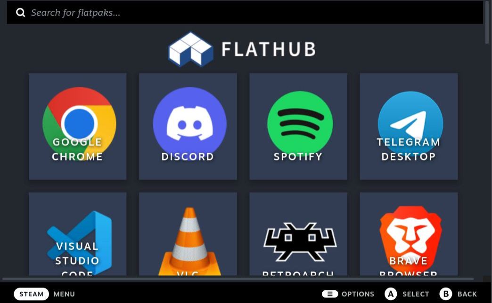

# Crankshaft Flathub

Steam Crankshaft plugin to manage and install Flatpaks from Flathub from
the comfort of Steam.

## Installation

Install [Crankshaft](https://crankshaft.space/) according to the normal
instructions provided.

Add the plugin from the Crankshaft plugin management screen.

## Screenshots

## Roadmap

- [x] Controller support
- [x] Support search using on-screen keyboard
- [ ] Add library shortcut without requiring Steam client restart
- [ ] Automatically add Flatpak shortcuts to a 'Flatpaks' collection
- [ ] Page tab where you can view currently installed Flatpaks
- [ ] Show [SteamGridDB](https://www.steamgriddb.com/) library artwork that will be used for Flatpak shortcut
- [ ] Allow user to cycle through and choose which library artwork from [SteamGridDB](https://www.steamgriddb.com/) they want to use
